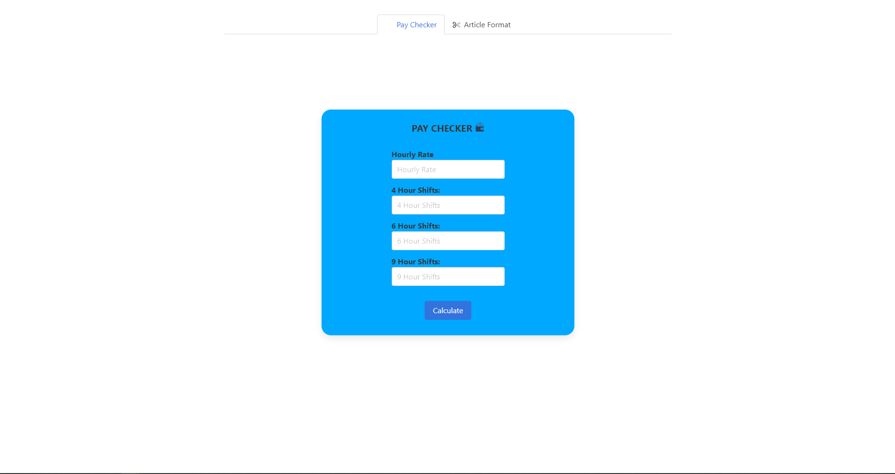
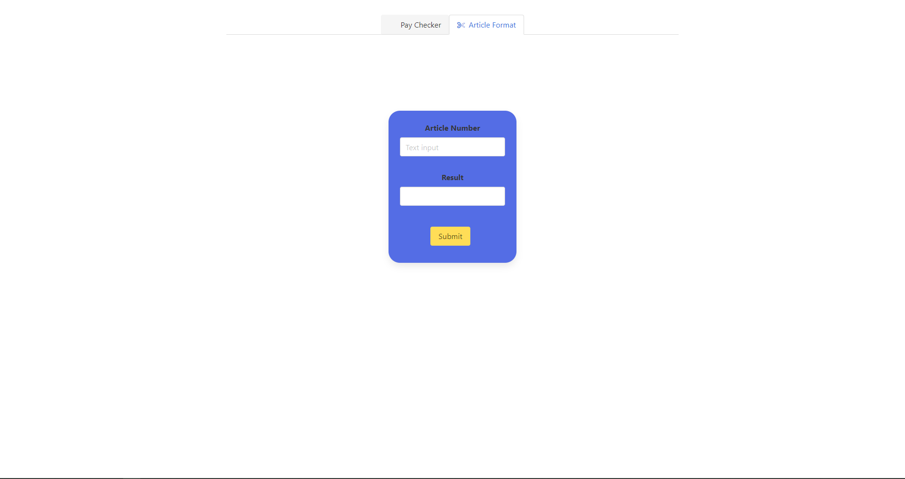

## Pluto

This application consists of 2 smaller applications. They are as follows: 

### Pay Checker 📈

A very light weight application designed to calculate an individuals gross pay based of their hourly pay rate and number of shifts worked over a certain period of time. It minimised the need to manually track the shifts I had worked and drastically reduced the time that is needed to calculate ones gross pay. This application came in handy during my time as a Sales Co-Worker at IKEA Dublin. 

Screenshots: 

### Article Number Formatter ✂️

A simple yet helpful application designed to format a given article number. Many of the systems I used at my workplace didn't always support the full stops that accompanied all article numbers. This application removes any full stops present in an article number reducing the need to manually remove them.

Screenshots: 

Website link: [https://harish-na.github.io/Pluto/](https://harish-na.github.io/Pluto/)

***
### Disclaimer
**WARNING!!** Users are welcome to reference the material present in this repository however, they are forbidden to copy my work and doing so will be considered plagiarism. All my work has been published online under my name and those who plagiarise my work will be doing so at their own risk and interest.

